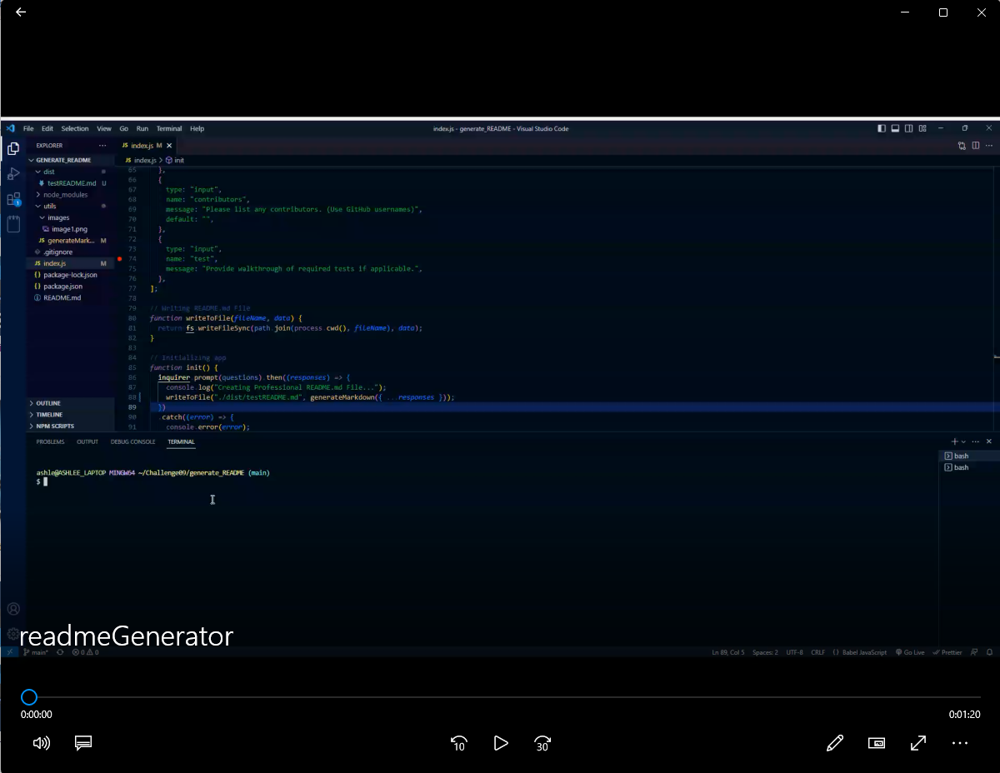

# README Generator

by Ashlee Huff


## Table of Contents
- [README Generator](#readme-generator)
  - [Table of Contents](#table-of-contents)
  - [Description](#description)
  - [Installation](#installation)
  - [Usage](#usage)
  - [Testing](#testing)
  - [License](#license)
  - [Questions](#questions)

## Description
Welcome to the README file for our README generator app! This file is intended to provide you with all the necessary information about our app, including installation instructions, usage examples, and licensing information.

The purpose of a README generator is to streamline the process of creating a README file. With a README generator, you can quickly and easily generate a README file by answering a series of questions about your project. The generator will use your answers to create a custom README file that includes all the necessary information for your project.

## Installation
To install the README generator app, you must first have Node.js installed on your computer. If you don't have Node.js installed, you can download it from the official website: https://nodejs.org/en/

Once you have Node.js installed, follow these steps:
1. Download or clone the repository for the README generator app to your local machine.
2. Open your terminal or command prompt and navigate to the root directory of the app.
3. Install the necessary dependencies by running the following command:

This will install the Inquirer package, which is used to prompt the user with questions.

```
    node install inquirer
```

1. You are now ready to use the README generator app! Run the following command to start the app:

    ```
    node index.js
    ```

This will start the app and prompt you with a series of questions to generate your README file.

That's it! You have successfully installed the README generator app and can now use it to generate professional README files for your projects.

## Usage
To use the README generator app, follow these steps:

1. Install the app by following the installation instructions provided in the README file.
2. Once the app is installed, open your terminal or command prompt and navigate to the root directory of the app.
3. Run the following command:

    ```
    node index.js
    ```

This will start the app and prompt you with a series of questions to generate your README file.

Click image to video Demo:
[](https://drive.google.com/file/d/1b5Rc46Of7vmSRHazlWtb4-CNc58J2hEE/view?usp=share_link)

1. Answer the questions prompted by the app, such as your project's title, description, installation instructions, usage examples, and licensing information.
2. After answering all the questions, the app will generate a custom README file in markdown format, which you can use for your project.

The generated README file will include all the necessary information about your project, including its purpose, installation instructions, usage examples, and licensing information. You can customize the formatting and styling of the file by editing the markdown syntax.

I designed the README generator app to be user-friendly and intuitive, with clear and concise questions that are relevant to your project. With this app, you can create a professional README file for your project in minutes, saving you time and effort.


## Testing
N/A

## License

This project is licensed under the Mozilla Public License 2.0 license.


## Questions
I hope you find the README generator app useful and enjoyable. If you encounter any issues or have any feedback, please don't hesitate to reach out to me.    

- Name - Ashlee Huff
- Email - huff.n.ashlee@gmail.com
- Github - https://github.com/ash12486/
